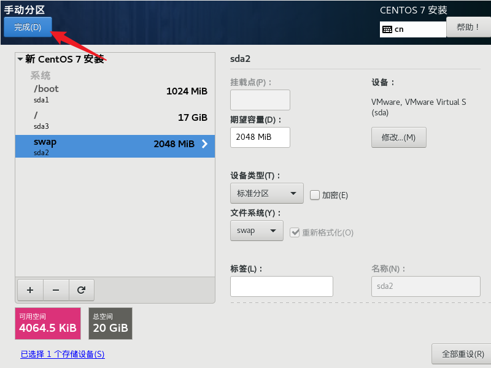
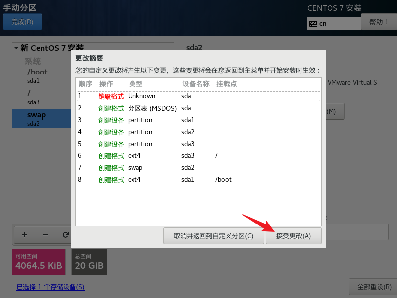
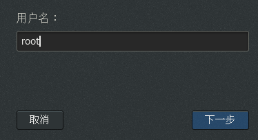
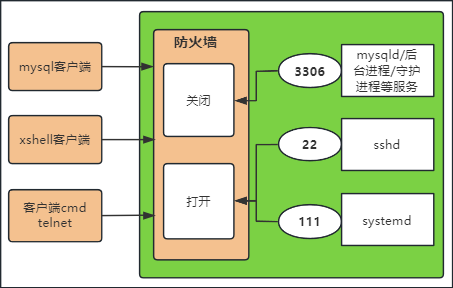
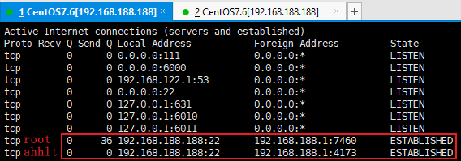
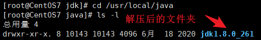
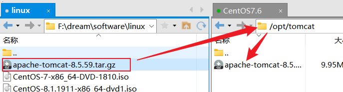
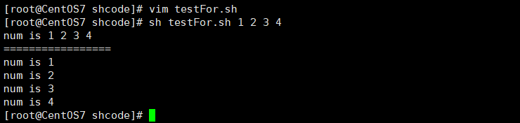
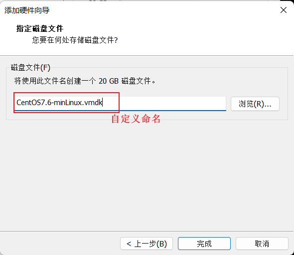
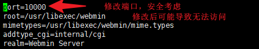

# Linux-CentOS学习笔记

> 该笔记是作者(爱喝胡辣汤)在哔哩哔哩学习`韩顺平老师`Linux教程后整理出来的，课程链接: [2021韩顺平图解Linux课程](https://www.bilibili.com/video/BV1Sv411r7vd/?spm_id_from=333.1007.top_right_bar_window_default_collection.content.click&vd_source=f82ef978a12020aff9d34f9905319abe)。

# 第一部分 基础篇

## 1.1 Linux概述

- `Linux`是一个`开源`、`免费`的操作系统，其具备良好的稳定性、安全性及处理多并发的能力，目前大多数服务器都运行Linux/Unix系统；

- 常见的其它操作系统，如`Windows、MacOS、Android、IOS`等；

- Linux之父Linux Torvalds，也是Git的创作者，开源贡献了Linux内核源码；

- 基于Linux内核的主要发行版本：**Ubuntu**、**RedHat**、**CentOS**、Fedora、Aliyun linux等等。

  

## 1.2 VMware的安装

- VMware Workstation是一款虚拟计算机软件。为了便于学习，通过VMware Workstation在自己的电脑上创建一个Linux系统的电脑，此时相当于拥有2台电脑，原理如下图；

- vmware官网：[VMware WorkStation下载链接](https://www.vmware.com/products/workstation-pro/workstation-pro-evaluation.html)，清华大学开源软件镜像站：[CentOS7下载链接](https://mirrors.tuna.tsinghua.edu.cn/centos/7/isos/x86_64/)；

- 下载的CentOS系统镜像文件后缀为`.iso`，如`CentOS-7-x86_64-DVD-1810.iso`或`CentOS-8.1.1911-x86_64-dvd1.iso`

- 需要先安装VMware Workstation，再安装Linux(CentOS7.6/CentOS8.1)；

- 原理示意图：主机上安装一个虚拟机软件，可以使用虚拟机软件创建多台不同操作系统的电脑。

  

  

**VMware Workstation安装步骤**：

> 作者(爱喝胡辣汤)安装的是VMware Workstation Pro 15.5版本

1. 安装之前需要进入电脑的`BIOS`里开启虚拟化设备支持，开机进入系统前`连续按`快捷键(F2或F12)，进入BIOS；

   

2. 进入BIOS以后移动至Configuration选项卡，将`Inter Virtual Technology`的值设置为`Enable`，按`F10`保存并退出；

   

3. 以`管理员身份运行`安装程序，执行步骤：

   

   

   

   

   

   

   

   

   

   

   

   

4. VMware Workstation Pro 15.5安装完毕，运行没有问题就可以创建虚拟机了。

   

## 1.3 CentOS7.6的安装

- 清华大学开源软件镜像站：[CentOS7下载链接](https://mirrors.tuna.tsinghua.edu.cn/centos/7/isos/x86_64/)；
- 下载的CentOS系统镜像文件后缀为`.iso`，如`CentOS-7-x86_64-DVD-1810.iso`或`CentOS-8.1.1911-x86_64-dvd1.iso`

**CentOS安装步骤**：

> 作者(爱喝胡辣汤)安装的是CentOS7.6版本，也可以安装CentOS8版本

1. 检查`Inter Virtual Technology`的值为`Enabled`；

   

2. 打开VMware Workstation，创建虚拟机；

   

   

   

   

3. 指定虚拟机名称、硬盘容量；

   

   

4. 自定义硬件；

   

   

   

   

5. 开始安装CentOS7.6系统，点击开启此虚拟机；

   

   

6. 加载CentOS安装信息界面

   

   

7. 软件选择

   

   

8. 点击安装位置，进行分区操作

   

   

9. 点击`+`，先指定`/boot`分区，大小为1G

   

   

   

   

   

   

   

   

   

10. 关闭Kdump；

    

    

11. 设置网络和主机名；

    

    

    

12. 设置root管理员密码，创建新用户；

    

    

    

    

    

13. 登录用户名，进入系统

    

    

    

    

    

    

14. 打开浏览器，测试网络

    

    

15. 安装完成。

## 1.4 VMware相关操作

### 1.4.1 虚拟机克隆

> 现在已经安装了一台CentOS7.6版本的Linux虚拟机，如果想要更多台虚拟机，`不需要再重新安装`，下面两种方法`可以直接克隆虚拟机`。

**方法1：直接拷贝一份安装好的虚拟机文件**

1. 拷贝虚拟机文件，将文件夹从E盘拷贝到其它盘符中，


2. 使用VMware软件`打开`刚拷贝的虚拟机文件夹，就得到了一台相同的虚拟机

   

   

**方法2：使用VMware的克隆操作**

> **`注意：克隆前必须关闭Linux系统`**

1. 点击克隆操作

   

2. 选择克隆源

   

3. 选择克隆类型

   

4. 设置虚拟机名称

   

5. 克隆完毕

   

   

### 1.4.2 虚拟机快照

> 快照的简单理解：快照就相当于`在某个时刻给虚拟机拍了一个照片`，记录当前虚拟机的所有状态(包括设置、所有文件等等)。之后如果虚拟机执行了误操作，可以`直接返回至保存快照时的系统状态`。

**应用实例：**

1. 安装好系统后，先保存一个快照A；

   

2. 进入系统后，创建文件夹test1，再保存一个快照B；

   

   

   

3. 返回至快照A的系统状态；

   

   

4. 试试现在是否还能回到快照B

   

   

### 1.4.3 虚拟机迁移与删除

1. **迁移**：虚拟机的本质是文件，直接将虚拟机文件夹`拷贝或粘贴`到其它位置，再通过VMware打开使用，实现虚拟机的迁移

2. **删除**：

   - 使用VMware删除

     

   - 直接手动删除虚拟机文件夹

     

## 1.5 VMware Tools与共享文件夹

### 1.5.1 VMware Tools的安装

1. VMware Tools更方便Windows下`管理VMware虚拟机`

2. 设置Windows和CentOS之间的`共享文件夹`

3. 共享文件夹可以被Windows和CentOS共同读写

   

**VMware Tools安装步骤：**

1. 点击重新安装VMware Tools

   

2. 进入主文件夹，将`xxx.tar.gz`文件拷贝到`/opt`目录下

   

   

   

3. 打开终端，进入/opt目录，使用tar -zxvf xxx.tar.gz指令，解压该压缩包

   

4. 进入解压后目录，执行安装程序，安装使用默认配置

   

### 1.5.2 设置共享文件夹

**设置共享文件夹步骤：**

1. CentOS7.6 -> 鼠标右键虚拟机设置；

   

2. 添加共享文件夹目录

   

   

3. 演示共享文件，共享文件夹在CentOS的路径`/mnt/hgfs/myshare`

   

   

## 1.6 Linux目录结构

> Linux世界里，一切皆文件。

1. Linux文件系统采用`级层式树状目录结构`，最上层是根目录"`/`"，此目录下创建其它目录

2. Linux目录结构图(不用背，`知道即可`)；

   

3. 常用目录结构图(`必须牢记`，熟练)

   

   

**具体的目录结构：**

根目录：`/`

- **`/bin`**：常用，(/usr/bin、/usr/local/bin)

  Binaries(二进制文件)的缩写, 这个目录存放着最经常使用的命令。

- **`/sbin`**：(/usr/bin、/usr/local/bin)

  s就是 Super User的意思，是Superuser Binaries(超级用户的二进制文件)的缩写，这里存放的是系统管理员使用的系统管理程序。

- **`/home`**：常用

  用户的主目录，在Linux中，每个用户都有一个自己的目录，一般该目录名是以用户的账号命名的，如上图中的alice、bob和eve。

- **`/root`**：常用

  该目录为系统管理员，也称作超级权限者的用户主目录。

- **`/lib`**：

  lib 是 Library(库) 的缩写这个目录里存放着系统最基本的动态连接共享库，其作用类似于 Windows 里的 DLL 文件。几乎所有的应用程序都需要用到这些共享库。

- **`/lost+found`**：

  这个目录一般情况下是空的，当系统非法关机后，这里就存放了一些文件。

- **`/etc`：**常用
  这个目录用来存放所有的系统管理所需要的配置文件和子目录，如mysql配置文件mysql.conf。

- **`/usr`**：常用
  usr是unix shared resources(共享资源)的缩写，这是一个非常重要的目录，用户的很多应用程序和文件都放在这个目录下，类似于windows下的program files目录。

- **`/boot`：**常用
  这里存放的是启动 Linux 时使用的一些核心文件，包括一些连接文件以及镜像文件。

- **`/proc`**：不能动
  是一个虚拟目录，它是系统内存的映射，访问这个目录来获取系统信息。

- **`/srv`**：不能动
  service的缩写，该目录存放一些服务启动之后需要提取的数据。

- **`/sys`**：不能动

  这是Linux2.6内核的一个很大的变化。该目录下安装了2.6内核中新出现的一个文件系统sysfs 。

- **`/tmp`**：
  tmp是temporary(临时)的缩写这个目录是用来存放一些临时文件的。

- **`/dev` ：**
  dev 是 Device(设备) 的缩写, 该目录下存放的是 Linux 的外部设备，在 Linux 中访问设备的方式和访问文件的方式是相同的。

- **`/media`**：常用
  linux 系统会自动识别一些设备，例如U盘、光驱等等，当识别后，Linux 会把识别的设备挂载到这个目录下。

- **`/mnt`**：常用
  系统提供该目录是为了让用户临时挂载别的文件系统的，我们可以将光驱挂载在 /mnt/ 上，然后进入该目录就可以查看光驱里的内容了。

- **`/opt`**：
  opt 是 optional(可选) 的缩写，这是给主机额外安装软件所摆放的目录。比如你安装一个ORACLE数据库则就可以放到这个目录下。默认是空的。

- **`/usr/local`**：常用

  这是另一个给主机安装额外软件所安装的目录，一般通过编译源码方式安装的程序。

- **`/var`**：常用
  这个目录中存放着在不断扩充着的东西，习惯将那些经常被修改的目录放在这个目录下。包括各种日志文件。

- **`/selinux`**：
  这个目录是 Redhat/CentOS 所特有的目录，Selinux 是一个安全机制，类似于 windows 的防火墙，但是这套机制比较复杂，这个目录就是存放selinux相关的文件的。


# 第二部分 实操篇

## 2.1 远程登录与文件传输

> 一般来说，正式上线的项目是运行在云端的Linux服务器上，程序员需要远程登录到Linux服务器对项目进行管理和开发。

### 2.1.1 远程登录Xshel

> 笔者(爱喝胡辣汤)安装的是目前最新版本Xshell 7，免费版官方下载链接[Xshell 7家庭学校免费版下载地址](https://www.xshell.com/zh/free-for-home-school/)。

1. Xshell是目前最好的远程登录Linux操作系统的软件，运行流畅且完美解决中文乱码问题；
2. Xshell是一个强大的安全`终端模拟软件`，支持`SSH1`，`SSH2`以及`TELNET协议`；
3. Xshell可以在Windows界面下来访问远端不同操作系统的服务器，达到远程控制的目的。

**Xshell的安装**：下载安装包以后，直接运行安装程序，傻瓜式安装。

**Xshell远程登录**：

1. 查看当前Linux主机的IP地址，打开CentOS7.6终端，输入指令`ifconfig`回车；

   

2. 打开Xshell，新建会话

   

3. 设置ip、端口号和协议

   

4. 输入Linux用户和密码，远程登录Linux

   

   

   

   

   

5. 使用指令`reboot`，实现远程重启Linux主机

   

### 2.1.2 远程文件传输Xftp

> 笔者(爱喝胡辣汤)安装的是目前最新版本Xftp7，免费版官方下载链接[Xftp 7家庭学校免费版下载地址](https://www.xshell.com/zh/free-for-home-school/)。
>
> Xftp是一款基于Windows平台的`SFTP、FTP`文件传输软件，使用Xftp可以将Windows PC上的文件直接传输至Linux/UNIX系统上。

**Xftp的安装**：下载安装包以后，与Xshell相同，直接傻瓜式安装。

**Xftp文件传输**：

1. 新建连接会话

   

   

2. 打开会话，建立连接

   

   

   

3. 文件传输

   

4. 查看文件，文件已经被传输到Linux系统的`/root`目录下

   

**Xftp中文乱码问题**：

> 乱码一般为编码问题，中文将编码改为`UTF-8`。


## 2.2 Vi和Vim编辑器

> Vi是Linux系统内置的`文本编辑器`，Vim是Vi的增强版，具有预定的程序编辑能力，可以主动辨别程序语法的正确性，还具有代码补全、编译及错误跳转等功能。

介绍常用模式之前，先使用Vim编辑器开发一个java文件，体会vim从编辑到保存文件的完整过程，有助于理解每个模式的作用。

**`演示：使用vim开发一个Hello.java文件：`**

1. 使用vim创建Hello.java文件；

   

2. 回车创建文件后，此时处于**`一般模式`**；

   

3. 按下`i,I,o,O,a,A,r,R`等任何一个按键，就会进入**`编辑模式`**，一般建议按**`i`**。

   

4. 现在可以对文件进行写入；

   

5. 保存时，先按`ESC键`，返回至**`命令行模式`**，输入`:wq`回车，就能保存编辑的内容到文件中；

   

6. 查看文件内容，输入`cat 文件名`，可以查看文件内容。

   

### 2.2.1 常用模式

- **一般模式：**使用指令`vim 文件路径`就是对该文件进行编辑，此时就进入了**`一般模式(默认模式)`**。该模式下可以使用【上下左右】按键来移动光标，删除字符或行，复制粘贴等操作。
- **编辑模式：**一般模式时，按`i,I,o,O,a,A,r,R`任一按键，就进入编辑模式，可以编辑文件内容。
- **命令行模式：**只要按`ESC`，再输入`:`，就可以使用相关指令，如读取`r`、写入`w`、替换、退出`q`以及显示行号`set nu`等操作。

### 2.2.2 模式切换

**模式切换图**：来源[2021韩顺平图解Linux课程](https://www.bilibili.com/video/BV1Sv411r7vd/?spm_id_from=333.1007.top_right_bar_window_default_collection.content.click&vd_source=f82ef978a12020aff9d34f9905319abe)。


### 2.2.3 Vim快捷键

**一般模式下：**

1. **`yy`**：拷贝当前行，拷贝当前行向下的5行`5yy`，粘贴`按p`；
2. **`dd`**：删除当前行，删除当前行向下的5行`5dd`；
3. **`G和gg`**：`G`直接移动到文档最末行，`gg`最首行；
4. **`u`**：撤销上个动作；
5. **`n (shift+g)`**：输入数字`n`，再同时按下`shift+g`，光标快速移动至文档第n行；

**命令行模式下：**

1. **`/关键字`**：再文件中查找`关键字`，如查到多个结果输入n可以切换下一个；
2. **`set nu和set nonu`**：设置文件行号`set nu`，取消文件行号`set nonu`；

> 更多快捷键，查看文档[Vim快捷键文档]()

**快捷键键盘图：**


## 2.3 实用指令

### 2.3.1 关机与重启

- **`shut down -h now`**：立刻关机；
- **`shut down -h n`**：`n`分钟后关机；
- **`shut down -r now`**：立刻重启；
- **`halt`**：关机；
- **`reboot`**：重启；
- **`sync`**：把内存的数据同步至磁盘；

**注意：**无论重启还是关机，都必须先执行`sync`指令。目前`shutdown/reboot/halt`指令都以在关机前执行`sync`。

### 2.3.2 用户登录与注销

1. 尽量少使用root帐号登录，系统管理员权限最大，避免误操作；
2. **`su - root`**：普通用户登录以后，使用`su - root`命令切换成系统管理员身份；
3. **`logout`**：注销用户，`logout`指令在图形运行级别无效，运行级别3下有效。

### 2.3.3 指定运行级别

> 运行级别相当于系统启动时选择的运行模式，不同级别特点不同。

**运行级别说明**：

- 级别0：关机；
- 级别1：单用户模式；
- 级别2：多用户状态没有网络服务；
- 级别3：多用户状态有网络服务；
- 级别4：系统未使用保留给用户；
- 级别5：图形界面；
- 级别6：系统重启；

**`常用运行级别为3和5，也可以指定默认运行级别.`**

**CentOS7以后运行级别说明：**

在`/etc/inittab`文件中


- **`systemctl get-default`**：获取系统当前默认运行级别。
- **`systemctl set-default TARGET.target`**：设置系统默认运行级别，`TARGET.target`是变量。如`systemctl set-default multi-user.target`多用户模式(无界面)，`systemctl set-default graphical.target`图形模式。

### 2.3.4 帮助指令

- **`man [命令或配置文件]`**：获得命令或配置文件的帮助信息，若查看隐藏文件，可使用组合如`ls -al`或`ls -alh`。
- **`help [命令]`**：获得shell内置命令的帮助信息。

### 2.3.5 文件目录指令

- **`pwd [选项]`**：显示当前工作目录的绝对路径。

- **`ls [选项]`**：显示目录或文件。`-a`显示所有文件和目录包括隐藏的、`-l`以列表的形式显示、`-h`显示内容更人性化。

- **`cd [参数] path`**：切换到指定的目录。`cd ~`回到用户的家目录，`cd ..`回到当前目录的上一级目录。

- **`mkdir [选项] path`**：创建目录。`-p`创建多级目录。

- **`rmdir [选项] path`**：删除空目录。如果删除的不是空目录，需要使用`rm -rf`强制删除。

- **`touch [文件名]`**：创建空文件。

- **`cp [选项] 源文件 目的地`**：拷贝文件到指定目录，将源文件拷贝到目的地。`-r`递归复制整个文件夹。强制覆盖不提示：`\cp`，`\cp -r /home/bbb/opt`。

- **`rm [选项] path`**：删除文件或目录。`-f`强制删除不提示，`-r`递归删除整个文件夹。

- **`mv oldNameFile newNameFile`**：移动文件或重命名。

- **`cat [选项] path`**：查看文件内容。`-n`显示行号。`cat`只能浏览文件，一般配合管道命令使用`cat -n /etc/profile | more`。

- **`more指令`**：**`more 要查看文件`**。more是基于Vi编辑器的文本过滤器，可以全屏按页显示文本内容，交互指令如下

  | 交互指令(快捷键) | 功能                     |
  | ---------------- | ------------------------ |
  | 空格(space)      | 向下翻一页               |
  | 回车(enter)      | 向下翻一行               |
  | q                | 退出                     |
  | Ctrl+F           | 向下滚动一屏             |
  | Ctrl+B           | 返回上一屏               |
  | =                | 输出当前行的行号         |
  | :f               | 输出文件名和当前行的行号 |

- **`less指令`**：**`less 要查看文件`**。分屏显示文件内容，与`more`指令相似，但`less`指令在显示文件时是显示多少就加载多少，more是先把整个文件加载。

  | 交互指令(快捷键) | 功能                                     |
  | ---------------- | ---------------------------------------- |
  | 空格(space)      | 向下翻一页                               |
  | [pagedown]       | 向下翻一页                               |
  | [pageup]         | 向上翻一页                               |
  | /字串            | 向下搜寻[字串]，n：向下查找，N：向上查找 |
  | ?字串            | 向上搜寻[字串]，n：向上查找，N：向下查找 |
  | q                | 退出                                     |

- **`echo [选项] [输出内容]`**：输出内容到控制台，类似于java的打印语句。

- **`head [选项] [文件]`**：默认查看文件头10行内容，`head -n 5 文件`查看文件的头5行内容。

- **`tail [选项] [文件]`**：默认查看文件末尾10行内容，`tail -n 5 文件`查看文件末尾的5行内容，`-f`追踪该文件的所有更新。

- **`>和>>`**：`>`为覆盖，`>>`为追加。如`ls -l > a.txt`将当前目录内容写入到a.txt(覆盖原来的内容)，`ls -al >> aa.txt`将当前目录内容写入文件aa.txt(追加内容到文件内)。

- **`ln -s [原文件或目录] [软链接名]`**：软连接也称为符号链接，相当于Windows的快捷方式，存放链接其它文件的路径。

- **`history`**：显示所有历史命令，`history n`显示最近使用过的`n`个指令。`!5`历史编号为5的指令。

### 2.3.6 时间日期类指令

- **`date`**：显示当前时间
- **`date+%Y`**：显示当前年份
- **`date+%m`**：显示当前月份
- **`date+%d`**：是西安当前是那一天
- **`date "+%Y-%m-%d %H:%M:%S"`**：显示年月日时分秒
- **`date -s 字符串时间`**：设置系统时间，如`date -s "2023-08-18 15:02:45"`
- **`cal [选项]`**：不加选项就显示本月日历，选项可以是年份或月份

### 2.3.7 搜索查找指令

- **`find [搜索范围] [选项]`**：find指令从指定目录向下递归地遍历其各个子目录，将满足条件的文件或目录显示在终端。

  | 选项                  | 功能                             | 示例                                                |
  | --------------------- | -------------------------------- | --------------------------------------------------- |
  | **`-name<查询方式>`** | 按照指定的文件名查找模式查找文件 | `find /home -name hello.txt`查找名为hello.txt的文件 |
  | **`-user<用户名>`**   | 查找属于指定用户名所拥有文件     | `find /opt -user root`查看root用户拥有的文件        |
  | **`-name<文件大小>`** | 按照指定的文件大小查找文件       | `find / -size +200M`查找文件大小大于200M的文件      |

- **`locate [搜索文件]`**：locate指令返回搜索文件的路径，无需遍历文件系统，使用locate数据库定位搜索文件，使用前必须使用`updatedb`指令更新数据库。

- **`which [指令]`**：查询某个指令在哪个目录下。

- **`grep [选项] 查找内容 源文件 `**：grep指令过滤查找，管道符`|`表示将前一个指令的处理结果交给后面的指令处理，如`cat /home/hello/hello.txt | grep "yes"`查询hello.txt文件中是否有yes。

  | 选项     | 功能             |
  | -------- | ---------------- |
  | **`-n`** | 显示匹配行及行号 |
  | **`-i`** | 忽略字母大小写   |

### 2.3.8 压缩解压指令


**gzip/gunzip指令**：

- **`gzip 文件名`**：压缩文件，只能将文件压缩为`*.gz`文件
- **`gunzip 文件名.gz`**：解压文件

**zip/unzip指令**：

- **`zip [选项] 文件/文件夹`**：压缩文件或文件夹，`-r`递归压缩压缩文件夹。
- **`unzip [选项] 文件名.zip`**：解压缩文件，`-d<目录>`指定解压后文件的存放目录。

**tar指令**：

> tar指令是打包指令，将文件打包为`*.tar.gz`的文件

- **`tar [选项] 文件名.tar.gz 要打包的文件`**：打包文件或问价夹，压缩后的文件格式`*.tar.gz`。

  | 选项     | 功能               |
  | -------- | ------------------ |
  | **`-c`** | 产生`.tar`打包文件 |
  | **`-v`** | 显示详细信息       |
  | **`-f`** | 指定压缩后的文件夹 |
  | **`-z`** | 打包同时压缩       |
  | **`-x`** | 解包`.tar`文件     |

- **`tar -zcvf 压缩后文件名.tar.gz 待压缩文件1 待压缩文件2 ... 待压缩文件n`**：打包文件，将带压缩文件/文件夹打包为`.tar.gz`文件，可打包多个文件。

- **`tar -zxvf 待解压文件 [-C] 解压后保存目录`**：解压文件，可以指定解压后保存的路径，但要使用选项`-C`，后跟路径。

## 2.4 用户与组

### 2.4.1 用户管理

> Linux系统是一个多用户多任务的操作系统，任何要使用系统资源的用户必须申请用户号

**添加用户**

- **`useradd 用户名`**：添加用户。添加用户后会自动创建和用户同名的家目录，也可以通过`useradd -d 指定目录 用户名`，给新建的用户指定家目录。
- **`passwd 用户名`**：给用户指定密码。

**删除用户**

- **`userdel 用户名`**：删除用户默认保留家目录
- **`userdel -r 用户名`**：删除用户及用户主目录

 **查询用户信息**

- **`id 用户名`**：返回用户信息uid、gid和组

**切换用户**

- **`su - 用户名`**：切换到目标用户下
- 高权限用户 -> 低权限用户，不需要输入密码，反之需要。
- 当需要返回原来的用户时，使用`exit/logout`。

**查看当前用户**

- **`whoaii/ who am i`**：返回用户登录信息

**其它指令**

- **`useradd -g 组名 用户名`**：添加用户时直接加到用户组中，如果不指定用户组，则系统默认创建一个与用户名相同的组，并将用户加入该组。
- **`usermod -g 组名 用户名`**：修改用户的所在组

**用户相关文件**：

- **`/etc/passwd`**：用户的配置文件，记录用户的信息。
- **`/etc/shadow`**：用户密码的文件。

### 2.4.2 组管理

> 类似于角色，系统对具有相同权限的用户进行同意的管理

- **`groupadd 组名`**：创建组
- **`groupdel 组名`**：删除组
- **`useradd -g 组名 用户名`**：添加用户时直接加到用户组中，如果不指定用户组，则系统默认创建一个与用户名相同的组，并将用户加入该组。

**组的相关文件**：

- **`/etc/group`**：组的配置文件，记录组的相关信息。

> 每个用户必须属于一个组，不能独立于组外，每个文件有所有者、所在组、其它组的概念

**对于文件/目录：**

- 文件所有者：创建文件的人，`ls -ahl`指令查看文件的所有者。
- 文件所在组：文件所有者所在的组。
- 其他组：文件所在组以外的组统称为其他组。

### 2.4.3 所在组

> 用户创建了文件/目录后，该文件的所在组就是用户所在的组(默认)。

**查看文件所在组**：

- **`ls -ahl`**：返回当前目录所有文件信息，可以看到文件所在组

**修改文件所在组**：

- **`chgrp 组名 文件名`**：修改文件的所在组

**修改用户所在组**：

- **`usermod -g 新组名 用户名`**：修改用户的所在组
- **`usermod -d 目录名 用户名`**：改变用户登录的初始目录

## 2.5 权限管理

### 2.5.1 权限说明

**`ls -l`**指令可以查看文件的权限：


如上图，每个文件信息的前10位(编号0-9)表示文件的权限信息。

**编号0-9位说明：**

- 第0位：表示文件类型，`d`目录，`-`普通文件，`l`软链接，`c`字符设备文件(鼠标、键盘)，`b`块设备(硬盘)。
- 第1-3位：表示文件所有者对该文件的权限。
- 第4-6位：表示所在组同组用户对该文件的权限。
- 第7-9位：表示其他用户对该文件的权限。

**rwx作用到文件**：

- **`[r]`**：代表可读(read)，可以读取查看文件内容。
- **`[w]`**：代表可写(write)，可以修改编辑。但不能删除，删除文件需要对该文件所在目录有写权限。
- **`[x]`**：代表可执行(execute)，可以被执行。

**rwx作用到目录：**

- **`[r]`**：代表可读(read)，可以读取，`ls`查看目录中的文件。
- **`[w]`**：代表可写(write)，可以修改。对目录内创建、删除和重命名文件/目录。
- **`[x]`**：代表可执行(execute)，可以进入该目录。

**案例说明**：说明下图两个文件的权限信息


1. **`[-rw-r--r--]`**：第0位`-`表示普通文件，第1-3位`rw-`表示所有者具有读和写权限，第4-6位`r--`表示同组用户只有读权限，第7-9位`r--`表示其它用户只有读权限。
2. **`[drwxr-xr-x]`**：第0位`d`表示目录，第1-3位`rwx`表示所有者具有读写和执行权限，第4-6位`r-x`表示同组用户具有读和执行权限，第7-9位`r-x`表示其它用户具有读和执行权限。
3. 后面信息是 硬链接数(文件)或子目录数(目录)+所有者+组+文件大小(字节)+最后修改时间+文件/目录名。

### 2.5.2 修改权限

> **`chmod`**指令可以修改文件或目录的权限。

**方式1：**`+`、`-`、`=`变更权限，`u`：所有者，`g`：所在组，`o`：其他人，`a`：所有人(u、g、o的综合)

- **`chmod u=rwx, g=rx, o=x 文件/目录名`**：授予权限
- **`chmod o+w 文件/目录名`**：增加权限
- **`chmod a-x 文件/目录名`**：减少权限

**方式2：**通过数字变更权限，`r=4`、`w=2`、`x=1`、`rwx=4+2+1=7`、`rw=4+2=6`等

- **`chmod u=rwx,g=rx,o=x 文件/目录名`**等价于**`chmod 751 文件/目录名`**。

## 2.6 定时任务

### 2.6.1 crond定时任务

**任务调度：**系统在某个时间执行的特定的命令或程序。

**任务调度分类：**

1. 系统工作：有些必须重复执行的重要工作，如病毒扫描
2. 个别用户工作：用户希望执行某些程序，如对mysql数据库的备份


**指令**：**`crontab [选项]`**

| 常用选项 | 功能                      |
| -------- | ------------------------- |
| **`-e`** | 编辑crontab定时任务       |
| **`-l`** | 查询crontab任务           |
| **`-r`** | 删除当前用户所有的crontab |

- **`crontab -r`**：终止任务调度
- **`crontab -l`**：列出当前所有定时任务
- **`service crond restart`**：重启任务调度

**快速入门：编辑一个任务调度**

1. 设置任务调度文件：`/etc/crontab`

2. 设置个人任务调度，执行`crontab -e`指令

   

3. 输入任务到调度文件

   

4. 查询当前的定时任务`crontab -l`

   

5. 执行任务后获得的to.txt文件内容

   

**定时任务指令中的5个占位符说明：**时间规则


| 项目          | 含义                 | 范围                |
| ------------- | -------------------- | ------------------- |
| **第一个`*`** | 一个小时中的第几分钟 | 0-59                |
| **第二个`*`** | 一天中的第几个小时   | 0-23                |
| **第三个`*`** | 一个月中的第几天     | 1-31                |
| **第四个`*`** | 一年中的地几个月     | 1-12                |
| **第五个`*`** | 一周中的星期几       | 0-7(0和7都是星期日) |

| 特殊符号 | 含义                                                         |
| -------- | ------------------------------------------------------------ |
| **`*`**  | 代表任何时间，比如第一个**`*`**就代表一个小时中的每分钟都执行一次 |
| **`,`**  | 代表不连续的时间，比如"`0 8,12,16 * * *`"代表每天的8点、12点、16点都执行一次命令 |
| **`-`**  | 代表连续的时间范围，比如"`0 5 * * 1-6`"代表周一到周六的凌晨5点执行 |
| **`/n`** | 代表每隔多久执行一次，比如"`*/10 * * * *`"代表每10分钟执行一次 |

**特殊时间执行案例：**

| 时间               | 含义                                                         |
| ------------------ | ------------------------------------------------------------ |
| **`45 22 * * *`**  | 22:45分执行                                                  |
| **`0 17 * * 1`**   | 每周一17点                                                   |
| **`0 5 1,15 * *`** | 每月1-15号5点                                                |
| **`40 4 * * 1-5`** | 周1-5的4点40                                                 |
| **`*/10 4 * * *`** | 4点的每10分钟                                                |
| **`0 0 1,15 * 1`** | 1号和15号 每周一0点0分，星期几和记号最好不要同时出现，易混淆 |

### 2.6.2 at定时任务

1. at定时任务是一次性定时计划任务，执行完一个任务不会再执行此任务
2. at的守护线程atd默认每60秒检查一次作业队列，有作业时核对作业运行时间，时间匹配时运行该作业
3. 使用at指令时要确保atd进程启动，查看atd进程指令`ps -ef | grep atd`


**at命令**：

- **`at [选项] [时间]`**：按下`Ctrl+D`结束at命令的输入

| 选项               | 功能                                                   |
| ------------------ | ------------------------------------------------------ |
| **`-m`**           | 当指定的任务被完成后，给用户发送邮件，即使没有标准输出 |
| **`-I`**           | atq的别名                                              |
| **`-d`**           | atrm的别名                                             |
| **`-v`**           | 显示任务将被执行的时间                                 |
| **`-c`**           | 打印任务的内容到标准输出                               |
| **`-V`**           | 显示版本信息                                           |
| **`-q<队列>`**     | 使用指定的队列                                         |
| **`-f<文件>`**     | 从指定文件读入任务而不是从标准输入读入                 |
| **`-t<时间参数>`** | 以时间参数的形式提交要运行的任务                       |

**at任务时间定义方法**

1. **`hh:mm`**：（小时:分钟），假设时间已过，则放在第二天执行
2. **`midnight/noon/teatime`**：深夜/中午/下午茶(一般下午4点)等模糊词语
3. 采用12小时制，在时间后加AM(上午)，PM(下午)来说明
4. 命令执行的具体日期：格式为`month day`（月 日）或`mm/dd/yy`（月/日/年）或`dd.mm.yy`（日.月.年），日期必须跟在时间后面
5. 相对计时法：`now + count time-units`，`now`当前时间，`time-units`时间单位，单位可以是`minutes`、`hours`、`days`、`weeks`，`count`是时间的数量，几天、几小时等
6. 直接使用`today`、`tomorrow`

## 2.7 磁盘管理

### 2.7.1 磁盘分区

**磁盘分区原理：**

1. Linux系统无论有几个分区，归根解读都只有一个根目录，分区分配给目录使用，每个分区都是整个文件系统的一部分。
2. Linux的整个文件系统包含了一系列文件和目录，将一个分区与一个目录联系起来。


**硬盘说明：**

1. Linux硬盘分位IDE硬盘和SCSI硬盘，现在基本都是SCSI硬盘
2. IDE硬盘，标识符为`hdx~`，hd表明分区所在设备的类型，这里指IDE硬盘。x为盘号(a为基本盘、b为基本从属盘、c为辅助主盘、d为辅助从属盘)，~代表分区(前四个分区用数字1-4表示，它们是主分区或扩展分区，从5开始为逻辑分区)。
3. SCSI硬盘，除标识符为`sdx~`外，其它都与IDE硬盘的表示方法相同。

**查看磁盘挂载情况：**

- **`lsblk`**：

  

- **`lsblk -f`**：

  

### 2.7.2 磁盘挂载

> 本节为磁盘挂载步骤。

**步骤：**

1. 添加新硬盘
2. 对新硬盘分区
3. 格式化分区
4. 挂载新硬盘


**添加新硬盘**

1. VMware虚拟机设置选项卡；

   

2. 点击添加；

   

3. 选择硬盘；

   

4. 选择磁盘类型`SCSI`；

   

5. 创建新虚拟磁盘；

   

6. 指定新磁盘大小；

   

7. 磁盘命名；

   

8. 添加完毕后，重启Linux主机，执行`lsblk`指令，查看磁盘

   

   

   重启后可以看到新添加的磁盘sdb，下一步对磁盘分区

**新硬盘分区**

> 开始分区后输入`n`新增分区，然后选择`p`，分区类型为主分区。两次回车默认剩余全部空间，写入分区并退出。

- **`fdisk /dev/sdb`**：分区命令，开始对`/sdb`分区。
- **`m`**：显示命令列表。
- **`p`**：显示磁盘分区，同**`fdisk -l`**。
- **`n`**：新增分区
- **`d`**：删除分区
- **`w`**：写入并推出
- **`q`**：退出，不保存


**格式化分区**

- **`mkfs -t ext4 /dev/sdb1`**：对分区`/dev/sdb1`进行格式化，`ext4`是分区类型

**分区挂载与卸载**

- **`mount 分区目录 挂载目录`**：将分区与目录联系起来，如`mount /dev/sdb1 /newdisk`。
- **`mount 分区目录/挂载目录`**：取消挂载

**永久挂载**

> 使用命令行挂载分区，Linux重启后挂载会失效，通过修改**`/etc/fstab`**文件实现永久挂载，添加完后执行**`mount -a`**。


### 2.7.1 磁盘信息查询

- **`df -h`**：查询系统整体磁盘使用情况

  

- **`du -h`**：查询指定目录的磁盘占用情况，默认为当卡目录。-s指定目录占用大小汇总，-h带计量单位，-a含文件，--max-depth=1子目录深度，-c列出明细同时增加汇总值。

  

- **`ls -l /opt | grep "^-" | wc -l`**：统计/opt文件夹下的**文件**个数

- **`ls -l /opt | grep "^d" | wc -l`**：统计/opt文件夹下的**目录**个数

- **`ls -lR /opt | grep "^d" | wc -l`**：统计/opt文件夹下的**文件**个数，包括子文件夹里的。

- **`ls -lR /opt | grep "^d" | wc -l`**：统计/opt文件夹下的**目录**个数，包括子文件夹里的**目录**。

- **`tree 目录`**：以树状显示目录结构tree目录。如果没有`tree`，使用`yum install tree`安装。

## 2.8 网络配置

### 2.8.1 NAT网络配置

**NAT网络原理图**


1. windows主机拥有两个网卡，自身网卡和虚拟网卡vmnet8，自身网卡负责与外部网络通信，虚拟网卡负责与Linux虚拟机通信。
2. 当Linux主机访问网络时，先将请求交给vmnet8，vmnet8再与windows网卡通信，windows才是真正与外部网络通信的网卡。

### 2.8.2 查看虚拟网络IP和网关

**虚拟网络编辑和网关：**

1. 打开网络编辑器；

   

2. 查看虚拟网络

   

3. NAT设置

   

### 2.8.3  Linux网络环境配置

**方法1**：DHCP，登陆Linux后自动获取IP地址，缺点每次登录Linux主机的IP地址可能不同。


**方法2：**静态IP，修改配置文件来指定静态IP地址，可直接连接到外网

1. **`编辑：vim /etc/sysconfig/network-scripts/ifcfg-ens33`**；

   

2. 编辑虚拟网络

   

3. **`service network restart`**重启网络服务或**`reboot`**重启系统，查看IP是否改变，检查是否可以上网。

### 2.8.4 设置主机名和hosts映射

> 为了方便记忆，可以给Linux系统设置主机名，通过主机名可以直接访问IP地址。

- `hostname`查看主机名，在`/etc/hostname`文件中指定主机名。

- **设置`hosts`映射：**通常Linux和Windows互相访问时需要执行`ping ip`，设置hosts映射以后直接使用`ping hostname`。

- **`Windows系统`**

  

  

- **`Linux系统`**

  

  

**主机名解析过程**：

- Hosts是文本文件，用于记录`IP`和`Hostname`(主机名)之间的**`映射`**关系。
- DNS，`Domain Name System`域名解析系统，互联网上保存域名和IP地址映射的分布式数据库。


## 2.9 进程管理

### **2.9.1 进程介绍**

1. Linux系统中，每个运行中的程序都称为一个进程，每个进程都分配一个ID号(**`pid进程号`**)；

2. 每个进程都可能有前台和后台，`前台`是指用户屏幕上可以点击操作的App界面，`后台`是指实现App上用户操作的进程；

3. **系统服务**一般都是以`后台运行的形式`存在，且常驻系统中，直到关机才结束；

4. Windows的进程界面，Linux系统实际与之类似.

   

### 2.9.2 显示进程

**`ps`指令：**

- **`ps -a`**：显示当前终端的所有进程信息；

- **`ps -u`**：以用户的格式显示进程信息；

- **`ps -x`**：显示后台进程运行的参数；

- **`ps -ef`**：全格式显示所有的进程，`-e`显示所有进程，`-f`全格式；

- **`System V`**：设置显示风格

- **`ps`**显示信息各字段含义

  | 字段(显示信息按列依次) | 含义                                                         |
  | ---------------------- | ------------------------------------------------------------ |
  | USER                   | 用户名称                                                     |
  | PID                    | 进程号                                                       |
  | %CPU                   | 进程占用CPU的百分比                                          |
  | %MEM                   | 进程占用物理内存的百分比                                     |
  | VSZ                    | 进程占用的虚拟内存大小（单位KB）                             |
  | RSS                    | 进程占用的物理内存大小（单位KB）                             |
  | TT                     | 终端名称，缩写                                               |
  | STAT                   | 进程状态，`S`睡眠，`s`该进程是会话的先到进程，`N`进程拥有比普通优先级更低的优先级，`R`正在运行，`D`短期等待，`Z`僵死程序，`T`被跟踪或被停止 |
  | STARTED                | 进程启动的时间                                               |
  | TIME                   | 进程使用CPU的时间                                            |
  | COMMAND                | 启动该进程所用的命令和参数，如果过长会被截断显示             |

  | 字段（BSD风格） | 含义                                                         |
  | --------------- | ------------------------------------------------------------ |
  | UID             | 用户ID                                                       |
  | PID             | 进程ID                                                       |
  | PPID            | 父进程ID                                                     |
  | C               | CPU用于计算执行优先级的因子。数值越大表示进程是CPU密集型运算优先级会降低，数值越小表示进程是I/O密集新运算优先级会提高 |
  | STIME           | 进程启动的时间                                               |
  | TTY             | 完整的终端名称                                               |
  | TIME            | CPU时间                                                      |
  | CMD             | 启动进程所用的命令和参数                                     |

- **`ps -aux|grep sshd`**：`使用-aux`查询sshd相关指令

  

- **`ps -ef|grep sshd`**：`使用-ed`查询sshd相关指令，BSD风格显示

  

### 2.9.3 终止进程

- **`kill [选项] PID`**：通过进程号`PID`终止进程。
- **`killall 进程名称`**：通过进程名称终止进程，支持通配符。
- **`[-9]`**：常用选项，表示**强制终止**进程。

### 2.9.4 查看进程树

- **`pstree [选项]`**：以树的形式显示所有进程，更直观

- **`[-p]`**：显示进程的PID

- **`[-u]`**：显示进程的所属用户

- **`pstree -p`**：

  

- **`pstree -u`**：

- 

## 2.10 服务管理

> 服务`service`的本质就是进程，是`只在后台运行`的进程，通常监听某个端口，等待其它程序的请求，又称为**守护进程**。

### 2.10.1 管理服务

- **`service 服务名 [start|stop|restart|reload|status]`**：`start`启动服务，`stop`终止服务，restart重启服务，`reload`重新加载，`status`服务状态。

- CentOS7.0以后很多服务不再使用`service`，而是`systemctl。`

- service指令可以管理的服务在`/etc/init.d`查看。

  

如**`service network stop`**关闭网络服务，**`service network start`**开启网络服务

### 2.10.2 查看服务

**方法1：**输入指令**`setup`**，点击【系统服务】，按**`tab`**可以移动光标

1. 输入指令**`setup`**；

   

2. 【系统服务】；

   

3. 自启服务

   

**方法2：**查看文件`/etc/init.d`内的服务

### 2.10.3 服务运行级别

> 规定哪些服务在哪个运行级别下自动启动

**Linux开机流程：**


系统启动进程启动以后会选择进入运行级别，该运行级别之下的服务也会别启动。

**`chkconfig`**指令：设置服务在某个运行级别下是否自启(开启、关闭)，`chkconfig`指令管理的服务在`/etc/init.d`查看，CentOS7以后很多服务使用`systemctl`管理

- **`chkconfig --list`**：查看所有服务，可以使用`| grep`查询指定服务。
- **`chkconfig 服务名 --list`**：根据服务名查询。
- **`chkconfig --level 服务名 on/off`**：设置该服务在运行级别下是否自启。

**`注意：chkconfig重新设置服务自启动(开/关)后，需要重启主机才生效！`**


### 2.10.4 systemctl指令

**`systemctl`管理服务：**

- **`systemctl [start|stop|restart|status] 服务名`**：管理服务，可管理的服务在`/usr/lib/systemd/system`查看

**`systemctl`设置服务自启：**

- **`systemctl list-unit-files`**：查看服务自启状态，可使用`grep`过滤
- **`systemctl enable 服务名`**：设置服务开启自启
- **`systemctl disable 服务名`**：关闭服务开机自启
- **`systemctl is-enable 服务名`**：查询某个服务是否为开机自启

实例：查看防火墙状态，开启关闭防火墙`firewalld.service`

`systemctl status firewalld`；`systemctl stop firewalld`；

`systemctl start firewalld`关闭或启用防火墙后立即生效，重启后复原设置。

### 2.10.5 网络防火墙

> 一般情况下，网络防火墙为打开状态，此时如果需要外部请求数据就不能那个跟服务器监听端口通讯，因此需要打开指定的端口

**防火墙原理图：**



1. 主机的防火墙一般为打开状态，但是可以打开指定的端口号
2. 客户端通过服务监听的端口号与服务进行通讯，当服务监听某端口时必须打开该端口

**firewall相关指令**：

- **`firewall-cmd --parmanent --add-port=端口号/协议`**：打开端口
- **`firewall-cmd --parmanent --remove-port=端口号/协议`**：关闭端口
- **`firewall-cmd --reload`**：打开或关闭端口后，需要重新加载，设置才能生效
- **`firewall-cmd --query-port=端口/协议`**：查看端口是否打开
- **`firewall-cmd --list-ports`**：查看打开的防火墙端口

### 2.10.6 动态监控进程

> **`top`**与**`ps`**指令类似，都是显示正在执行的进程，但**`top`**指令返回`进程的实时状态`。

- **`top [选项]`**：返回进程实时状态信息。

- 选项说明

  | 选项     | 说明                                                   |
  | -------- | ------------------------------------------------------ |
  | **`-d`** | 指定**`top`**指令返回的进程信息，每隔几秒更新，默认3秒 |
  | **`-i`** | 不显示`闲置`或`僵死`进程                               |
  | **`-p`** | 通过指定进程ID，仅返回该PID对应进程的信息              |

- 交互操作说明

  | 操作【按键】 | 功能                  |
  | ------------ | --------------------- |
  | P键          | 以CPU使用率排序，默认 |
  | M键          | 以内存使用率排序      |
  | N键          | 以PID排序             |
  | q键          | 退出                  |


### 2.10.7 监控网络状态

**查看系统网络状态**

- **`netstat [选项]`**：查看网络状态，`-an`按一定顺序排序输出，`-p`显示哪个进程在调用。

  

- 外部地址就是访问Linux系统的进程所在的主机ip地址+端口号

- 查看服务名sshd的信息

  

**外部地址：**




## 2.11 软件包管理

### 2.11.1 rpm包管理工具

> rpm是用于下载包的打包及安装工具，可以生成具有.rpm扩展名的文件。RPM是RedHat Package Manager(RedHat软件包管理工具)的缩写，类似于Windows的setup.exe。

**查询指令**

- **`rpm -qa`**：查询已安装的rpm列表，可以用`grep`指令过滤查询结构，`rpm -qa|more`或`rpm -qa|grep xxx`。
- **`rpm -q 软件包名`**：查询`软件包`是否安装
- **`rpm -qi 软件包名`**：查询软件包信息
- **`rpm -ql 软件包名`**：查询软件包中的文件
- **`rpm -qf 文件全路径名`**：查询文件所属的软甲包

**安装指令**

- **`rpm -ivh RPM包全路径名称`**：安装RPM软件包，`i=install`安装，`v=verbose`提示，`h=hash`进度条

**卸载指令**

- **`rpm -e RPM包名称`**：卸载RPM包

- **注意：如果系统有其它软件包依赖于该软件包，卸载时将会产生错误信息**

### 2.11.2 yum包管理工具

> yum是一款shell前端软件包管理器，`基于RPM`包管理。可以从指定的服务器下载RMP包并且安装，`自动处理依赖关系`，一次性安装所有依赖的软件包。

- **`yum list|grep 软件包名`**：查看yum服务器是否有需要安装的软件
- **`yum install 软件包名`**：安装软件包


# 第三部分 高级篇

## 3.1 配置JavaEE环境

### 3.1.1 安装JDK

> 安装**`JDK1.8`**版本。

**安装步骤：**

1. 创建文件夹**`/opt/jdk`**；
2. 上传安装包至**`/opt/jdk`**；
3. 创建文件夹**`/usr/local/java`**并将安装包至该目录下；
4. 配置环境变量；
5. 使环境变量文件生效；
6. 编译并运行`Java`文件。

**具体步骤**：

1. 创建文件夹**`mkdir /opt/jdk`**；

   

2. 上传安装包至**`/opt/jdk`**；

   

3. 解压安装包至**`mkdir /usr/local/java`**，指令**`tar -zxvf jdk-8u261-linux-x64.tar.gz -C /usr/local/java`**；

   

   

   

4. 配置环境变量**`vim /etc/profile`**；

   

5. 使环境变量文件生效**`source /etc/profile`**；

   

6. 测试**`jdk`**，编译并运行**`Hello.java`**文件；

   

### 3.1.2 安装tomcat

**安装步骤：**

1. 创建目录**`/opt/tomcat`**并通过`Xftp`将`tomcat`压缩包上传至该目录；
2. 将压缩包解压至**`/opt/tomcat`**；
3. 进入解压目录**`/bin`**，启动`tomcat`；
4. 打开防火墙端口8080，访问tomcat本地服务器地址。

**具体步骤：**

1. 创建文件夹**`/opt/tomcat`**并通过`Xftp`将`tomcat`安装包上传至该目录下；

   

   

2. 解压安装包至**`/opt/tomcat`**；

   

3. 进入解压目录**`/bin`**，启动`tomcat` **:`./startup.sh`**；

   

   

4. 开放端口`8080`，**`firewall-cmd --add-port=8080/tcp`**；

   

5. 访问**`http://192.168.188.188:8080`**，是否安装成功。

   

### 3.1.3 安装idea

> 安装最新的**`idea2023.2`**版本，官网下载Linux系统的**`.tar.gz`**压缩包。

**安装步骤：**

1. 创建目录**`/opt/idea202302`**；
2. 上传压缩包，并解压；
3. 执行安装程序。

**具体步骤：**

1. 使用`CentOS7.6`的终端，创建目录**`/opt/idea202302`**；

   

2. 使用`Xftp`将`idea2023.2`版压缩包上传至**`/opt/idea202302`**，并解压到当前目录；

   

   

3. 进入`/bin`目录，指令**`/.idea.sh`**，运行**`idea.sh`**脚本进入安装程序；

   

   

4. 进入安装程序，安装完毕

   

### 3.1.4 安装mysql

> 安装**`mysql5.7`**版本，通过`wget http://dev.mysql.com/get/mysql-5.7.26-1.el7.x86_64.rpm-bundle.tar`下载`rpm`软件包。

**安装步骤：**

1. 卸载`CentOS7.6`自带的数据库`mariadb`，避免与`mysql`发生冲突；

   

2. 创建目录**`/opt/mysql5.7`**，进入该目录，下载`mysql5.7`的`rpm`软件包；

   

3. 解压软件包**`tar -xvf mysql-5.7.26-1.el7.x86_64.rpm-bundle.tar`**；

   

   

4. 依次安装，`common`，`libs`，`client`，`server`；

   

   

   

   

5. 运行**`systemctl start mysqld.service`**，启动`mysql`；

6. 设置用户密码，`mysql`自动给`root`用户设置随机密码，运行**`grep "password" /var/log/mysqld.log`**可看到当前密码；6aQn3uni>pd9

   

7. 运行**`mysql -u root  -p`**，用`root`用户登录，进入mysql命令行；

8. 运行**`set global validate_password_policy=0;`**降低密码设置策略，`validate_password_policy`默认值`1`；

9. `mysql`命令行执行**`set password for 'root'@'localhost' =password('ahhlt1002');`**；

10. 运行**`flush privileges;`**使密码设置生效。

    

## 3.2 shell编程

### 3.2.1 shell介绍

> Shell脚本可以用来管理服务器或维护程序，如管理服务器集群，定时备份数据库文件等。


- Shell终端执行的命令，需要使用Shell解释器解释，再传给Linux系统内核执行Shell命令；
- 脚本以**`#!/bin/bash`**开头，脚本文件必须有`可执行权限`；
- Shell多行注释方式：**`:<<! 注释内容 !`**。

**常用脚本执行方式**

- 方式1：输入脚本的绝对路径或相对路径，如**`/root/shcode/hello.sh`**或**`./hello.sh`**。但必须保证脚本文件具有可执行权限，使用**`chmod`**指令可以增加权限。
- 方式2：不用赋予脚本可执行权限，使用**`sh filename.sh`**，如**`sh hello.sh`**。

**编写一个sh脚本并执行：**

1. 创建目录`/root/shcode`和脚本文件`hello.sh`；

   

2. 编写脚本文件`hello.sh`；

   

3. 执行脚本文件，方式2直接执行**`sh hello.sh`**

   

4. 方式1，先加可执行权限

   

### 3.2.2 变量

**变量介绍：**Linux中的Shell变量分为**`系统变量`**和用户**`自定义变量`**。

- 系统变量：$HOME、$PWD、$SHELL、$USER等等，系统自有的变量如环境变量，**`set`**指令显示`shell`中所有变量。

- 自定义变量：定义变量**`变量名=值`**，撤销变量**`unset 变量名`**，定义静态变量**`readonly 变量`**，不能撤销静态变量。

- 尝试定义变量、撤销变量、定义静态变量

  

  

**变量定义规则：**

1. 变量名可以由字母、数字和下划线组成，但是不能以数组开头，如5A=200是错的；
2. 等号=两端不能由空格；
3. 变量名一般为大写字母(规范)。

**注意：**将指令执行后的结果赋给变量，使用反引号**``**或**$(xxx)**


**设置环境变量：**环境变量文件为**`/etc/profile`**

- **`export 变量名=变量值`**：将shell变量输出为环境变量/全局变量
- **`source 配置文件`**：让修改后的配置信息立即生效
- **`echo $变量名`**：查询环境变量的值

快速入门案例

1. 在`/etc/profile`文件中定义`TOMCAT_HOME`环境变量，并立即生效

   

   

2. 在`var.sh`脚本中调用查询`TOMCAT_HOME`的值

   

   

**位置参数变量：**定义在shell脚本程序中，相当于占位符，可以通过命令行给对应位置传入实际值，shell脚本通过**`$1-$9`**来确定位置。

- **`$n`**：`n`为数字，`$0`代表命令本身，`$1-$9`代表第`1`到第`9`个参数，`10`以上的参数需要使用大括号包含`${10}`
- **`$*`**：代表命令行中的所有参数，把所有参数看作一个整体
- **`$@`**：代表命令行中的所有参数，但把每个参数都看作一个独立的个体
- **`$#`**：代表命令行中所有参数的个数

案例：编写`position.sh`，在脚本中获取到命令行传入的各个参数的信息

1. 编写脚本`position.sh`；

   

2. 执行脚本；

   

**预定义变量：**Shell设计者定义好的变量，可以在shell脚本中使用

- **`$$`**：当前进程的进程号；
- **`$!`**：后台运行的最后一个进程的进程号；
- **`$?`**：最后一次执行的命令的返回状态。如该变量为0说明上个命令正确执行，否则上个命令执行不正确。

案例：编写脚本使用预定义变量

1. 编写脚本`preVar.sh`；

   

2. 执行脚本；

   

### 3.2.3 运算符

**Shell中的各种运算操作：**

- **`$((运算式))`**或**`$[运算式]`**或**`expr m + n`**

- 注意：expr运算符之间要有空格；

- **`expr \*,/,%`**：乘，除，取余；

- 案例：

  

  

### 3.2.4 控制结构

**判断语句：`[ condition ]`**非空返回`true`。如**`[ ahhlt ]`**返回`ture`，**`[ ]`**返回`false`。

**`[ condition ] && echo OK || echo NOOK`**条件满足执行`&&`后，不满足执行`||`后面的语句。

**常用判断条件：**

| 条件      | 功能                     |
| --------- | ------------------------ |
| **`=`**   | 字符串比较               |
| **`-lt`** | 小于，`little`           |
| **`-le`** | 小于等于，`little equal` |
| **`-eq`** | 等于，`equal`            |
| **`-gt`** | 大于，`great`            |
| **`-ge`** | 大于等于，`great equal`  |
| **`-ne`** | 不等于，`no equal`       |
| **`-r`**  | 有读的权限               |
| **`-w`**  | 有写的权限               |
| **`-x`**  | 有执行的权限             |
| **`-f`**  | 文件存在且是一个常规文件 |
| **`-e`**  | 文件存在                 |
| **`-d`**  | 文件存在且是一个目录     |

- 演示：

**`if`条件判断语句：**

- 基本语法

  ```bash
  # 1.if判断语句基本语法
  if [ 条件判断式 ]
  then
  	代码
  fi
  
  # 2.if多分支语句
  if [ 条件判断式 ]
  then
  	代码1
  elif [ 条件判断式 ]
  then
  	代码2
  fi
  ```

- 注意：**`[ 条件判断式 ]`**，中括号和条件判断式之间必须有空格；

- 演示：编写shell程序，如果输入的参数大于等于60，输出及格了，否则输出不及格

  

  

**`case`分支语句：**

- 基本语法：

  ```bash
  case $变量名 in
  "值1")
  代码1 #如果变量的值=值1，则执行代码1
  ;;
  "值2")
  代码2 #如果变量的值=值2，则执行代码2
  ;;
  ...省略其它分支...
  *)
  默认代码 #如果变量的值都不等于以上的值，则执行默认代码
  ;;
  esac
  ```

- 演示：命令行参数为1时，输出周一，为2时，输出周二，其它输出other

  

  

**`for`循环语句：**

- 基本语法

  ```shell
  # 基本语法1
  for 变量 in 值1 值2 值3 ...
  do
  	代码
  done
  
  # 基本语法2
  for((初始值;循环控制条件;变量迭代))
  do
  	代码
  done
  ```

- 演示：语法1

  

  

- 演示：语法2

  

  

**`while`循环语句：**

- 基本语法：

  ```shell
  while [ 条件判断式 ]
  do
  	代码
  done
  ```

- 演示：从命令行输入一个数n，统计1+2+..+n的值是多少

  

  

### 3.2.5 read读取输入

- **`read [选项] (参数)`**：从Shell控制台读取用户输入。

- 选项

  | 选项     | 功能                                                         |
  | -------- | ------------------------------------------------------------ |
  | **`-p`** | 指定读取用户输入时的提示符                                   |
  | **`-t`** | 指定读取用户输入时等待的时间(秒)，如果在指定时间内没有输入，就会关闭`read` |

- **`(参数)`**：变量，指定读取用户输入值的变量名

演示：读取一个num值


### 3.2.6 函数

**系统函数：**系统自带的函数，可以直接调用

1. **`basename`**函数：返回绝对路径中的**`文件名和文件后缀`**部分，常用于获取文件名

   - **`basename [path/string][suffix]`**：返回`path`路径中的文件名和文件后缀。如果指定了**`[suffix]`**，则将文件名和后缀中的`[suffix]`也删除。

2. **`dirname`**函数：返回绝对路径中的**`目录部分`**，常用于获取目录

   - **`dirname [path]`**：返回绝对路径中的目录部分

3. 演示

   

**自定义函数：**

- 基本语法

  ```shell
  [ function ] funcname[()]
  {
  	函数体;
  	[return int;]
  }
  ```

- 调用直接写函数名：`funname [值]`

- 演示：计算两个参数的和，getSum

  

  

## 3.3 日志管理

> 日志文件中记录了许多重要的系统时间，如用户登录信息、系统启动信息等等。通过日志可以检查系统错误发生的原因或攻击者留下的痕迹。

### 3.3.1 系统常用日志

- **`/var/log/`**目录中保存系统的日志文件

  

  | 日志文件                | 说明                                                         |
  | ----------------------- | ------------------------------------------------------------ |
  | **`/var/log/boot.log`** | 系统启动日志                                                 |
  | **`/var/log/cron`**     | 记录与系统定时任务相关的日志                                 |
  | **`/var/log/cpus/`**    | 记录打印信息的日志                                           |
  | **`/var/log/dmesg`**    | 记录系统打开机时内核自检的信息，也可以使用**`dmesg`**命令直接查看内核自检信息 |
  | **`/var/log/btmp`**     | 记录错误登录的日志，二进制文件，不能直接使用Vi查看，要使用**`lastb`**查看，如**`[root@localhost log]#lastb`** |
  | **`/var/log/lastlog`**  | 记录系统中所有用户最后一次登录时间的日志，二进制文件，要使用**`lastb`**查看 |
  | **`/var/log/mailog`**   | 记录邮件信息的日志                                           |
  | **`/var/log/message`**  | 记录系统重要信息的日志，该文件会记录Linux系统的绝大数重要信息。如系统出现问题，首先要检查的就是这个文件 |
  | **`/var/log/secure`**   | 记录验证和授权方面的信息，只要涉及账户和密码程序都会记录，比如系统登陆，`ssh`的登录，`su`切换用户，`sudo`授权，添加用户和修改用户密码都会记录。 |
  | **`/var/log/wtmp`**     | 永久记录所有用户的登录、注销信息，同时记录系统的后动、重启、关机时间，二进制文件，使用`lastb`命令查看 |
  | **`/var/log/ulmp`**     | 记录当前已登录的用户信息，这个文件会随着用户的登录和注销不断变化，只记录当前登录用户的信息，不能使用Vi查看，要使用`w`、`who`、`user`等命令查看 |

查看文件`/var/log/secure`


查看文件`/etc/rsyslog.conf`


### 3.3.2 日志管理服务

- CentOS7.6日志服务是rsyslogd，CentOS6.x是syslogd，rsyslogd功能更强大，两个服务的日志文件格式和日志的使用是兼容的

- **`ps aux | grep "rsyslog" | grep -v "grep"`**：查询Linux中的rsyslog服务是否启动；

- **`systemctl list-unit-files | grep rsyslog`**：查询rsyslogd服务的自启动状态；

  


### 3.3.3 日志配置文件

配置文件：**`/etc/rsyslog.conf`**

- 编辑文件格式：**`*.*    存放日志的路径`**，如`cron.*  /var/log/cron`，其中第1个`*`代表日志类型，第2个`*`代表日志级别

- 日志类型

  | 日志类型                   | 含义                                |
  | -------------------------- | ----------------------------------- |
  | **`auth`**                 | pam产生的日志                       |
  | **`authpriv`**             | ssh、ftp等登录信息的验证信息        |
  | **`corn`**                 | 时间任务相关                        |
  | **`kern`**                 | 内核                                |
  | **`lpr`**                  | 打印                                |
  | **`mail`**                 | 邮件                                |
  | **`mark(syslog)-rsyslog`** | 服务内部的信息，时间标识            |
  | **`news`**                 | 新闻组                              |
  | **`user`**                 | 用户程序产生的相关信息              |
  | **`uucp`**                 | unix to nuix copy主机之间相关的通讯 |
  | **`local 1-7`**            | 自定义日志设备                      |

- 日志级别：从上到下，级别从低到高，记录信息越来越少，因为最后内核崩溃的时候什么都记录不了了

  | 日志级别      | 含义                                                 |
  | ------------- | ---------------------------------------------------- |
  | **`debug`**   | 有调试信息的，日志通讯最多                           |
  | **`info`**    | 一般是信息表，最常用                                 |
  | **`notice`**  | 最具有重要性的普通条件的信息                         |
  | **`warning`** | 警告级别                                             |
  | **`err`**     | 错误级别，阻止某个功能或模块不能正常工作             |
  | **`crit`**    | 严重级别，阻止整个系统或者整个软件不能正常工作的信息 |
  | **`alert`**   | 需要立即修改的信息                                   |
  | **`emerg`**   | 内核崩溃等重要信息                                   |
  | **`none`**    | 什么都不记录                                         |

- 日志信息

  

### 3.3.7 自定义日志服务

在`/etc/rsyslog.conf`中添加一个日志文件`/var/log/ahhlt.log`，当有事件发生时，日志信息会保存到该文件中。

1. 添加自定义日志

   

2. 关机、重启后，查看`/var/log/ahhlt.log`文件中是否记录了重启信息

   

### 3.3.4 日志轮替

日志轮替就是把旧的日志文件移动并改名，同时建立新的空日志文件，当旧日志文件超出保存范围后，就会删除。

**日志轮替文件命名：**

1. `CentOS7`使用**`logrotate`**进行日志轮替管理，要改变日志轮替文件名字，通过`/etc/logrotate.conf`配置文件中**`dateext`**参数；
2. 如果配置文件中有**`dateext`**参数，日志会用**`日期`**来作为文件名的一部分。如`source-20230223`，这样日志文件名不会重叠，也就不需要改名。只需要指定保存日志的个数，多余的日志文件会被删除。
3. 如果配置文件中没有**`dateext`**参数，当第一次日志轮替时，当前的secure日志会被改为secure.1，然后新建secure用来保存新日志。当第二次日志轮替时，secure会被改为secure.1，secure.1会被改为secure.2，新建secure用来保存新日志，依次类推。

**`logrotate`配置文件**：


**配置文件相关参数说明：**

| 参数                      | 说明                                             |
| ------------------------- | ------------------------------------------------ |
| `daily`                   | 每天轮替                                         |
| `weekly`                  | 每周轮替                                         |
| `monthly`                 | 每月轮替                                         |
| `rotate`                  | 保留日志文件个数，0指没有备份                    |
| `compress`                | 日志轮替时，旧的日志进行压缩                     |
| `create mode owner group` | 建立新日志，同时指定新日志的权限、所有者和所属组 |
| `mail address`            | 日志轮替时，输出内容通过邮件发送到指定的邮件地址 |
| `missingok`               | 如果日志不存在，则忽略该日志的警告信息           |
| `notifempty`              | 如果日志为空文件，则不进行日志轮替               |
| `minsize`                 | 日志轮替的最小值，超过这个指时才会轮替           |
| `size`                    | 日志文件大于指定大小后才进行轮替                 |
| `dateext`                 | 使用日期作为日志轮替文件的后缀                   |
| `sharedscrips`            | 在此关键字之后的脚本只执行一次                   |
| `prerotate/endscript`     | 在日志轮替之前执行脚本命令                       |
| `postrotate/endscript`    | 在日志轮替之后执行脚本命令                       |

**将自己的日志加入日志轮替：**

- 方法1：直接在/etc/logrotate.conf配置文件中写入该日志的轮替策略

- 方法2：在/etc/logrotate.d/目录中新建该日志的轮替文件，在该轮替文件中写入轮替策略，推荐使用该方法

  

### 3.3.5 查看内存日志

- **`journalctl`**：查看全部
- **`journalctl -n 3`**：查看最新3条
- **`journalctl --since 19:00 --until 19:10:10`**：查看起始时间到结束时间的日志，可加日期
- **`journalctl -p err`**：报错日志
- **`journalctl -o verbose`**：日志详细内容
- **`journalctl_PID=1245 _COMM=sshd`**：查看包含这些参数的日志(在详细日志查看)或者**`journalctl | grep sshd`**

内存日志，重启后会被清空。

## 3.4 Linux内核

### 3.4.1 定制Linux

**Linux启动流程：**

1. Linux系统自检，检查硬件是否有故障；
2. 若有多块启动盘，需要在`BIOS`中选择启动盘；
3. 启动`MBR`中得`Bootloader`引导程序；
4. 加载内核文件；
5. 执行所有进程的父进程**`systemd`**；
6. 启动成功，欢迎界面

**制作minLinux系统盘思路：**

1. 在当前Linux系统上添加硬盘`/dev/sdb`，并且分两个分区`/boot`和`/`，并格式化`ext4`；
2. 将`/dev/sdb`硬盘制作为一个独立的Linux系统，把Linux运行时必要的文件拷贝进去，包括**`内核文件`**和**`initramfs`**文件等；
3. 以完成后就拥有了一个最小Linux系统硬盘，创建一个新的虚拟机，将硬盘指向这个最小Linux系统硬盘，启动即可。

**制作minLinux(CentOS7.6)步骤：**

1. 给当前Linux系统添加一个硬盘，大小20G，类型SCSI。添加后重启系统通过指令lsblk查看；

   

   

   

   

   

2. 分区 通过**`fdisk`**来给我们的`/dev/sdb`进行分区；

3. 格式化

4. 挂载

5. 安装grub，拷贝内核文件

### 3.4.2 内核源码

> 韩顺平老师寄语，深入了解操作系统的底层机制，有利于理解多线程高并发原理，包括架构、优化、算法会有不一样的认知高度

- Linux内核源码地址：`https://www.kernel.org`。
- 从Linux0.01内核入手，总共代码10000行左右。

**源码阅读技巧：**

1. 需要了解C语言；
2. 应该了解Linux内核源码的整体分布情况。现代操作系统一般由进程管理、内存管理、文件系统、驱动程序和网络组成，Linux内核源码大致相同；
3. 阅读方法，纵向指按系统运行的执行顺序阅读，横向指按模块阅读，通常将二者结合；

**Linux0.01源码目录结构：**


**`linux0.01/init/main.c`文件中的`main`函数：**


### 3.4.2 内核升级

对于内核升级，需要考虑版本兼容性


- **`uname -a`**：查看当前的内核版本
- **`yum info kernel -q`**：检测内核版本，显示可升级的内核
- **`yum update kernel`**：升级内核
- **`yum list kernel -q`**：查看已安装的内核

**下载解压最新版：**`wget https://cdn.kernel.org/pub/linux/kernel/v6.x/linux-6.4.11.tar.gz`

## 3.5 备份与恢复

> 当Linux系统安装在一个实体机上时，为防止因系统损坏导致数据丢失，Linux提供了对文件或分区的备份和恢复功能

**备份和恢复的两种方式：**

1. 方法1：直接使用**`tar`**将需要备份的文件打包，需要恢复时再解压覆盖
2. 方法2：使用**`dump`**和**`restore`**

**`dump`和`restore`的安装：**

- **`yum -y install dump`**：安装**`dump`**。
- **`yum -y install restore`**：安装**`restore`**。

### 3.5.1 dump备份

- `dump`支持分卷和增量备份，增量备份指备份上次备份后修改/增加过的文件，也称差异备份。增量备份仅支持备份分区，备份文件或目录时必须是层级0备份。

- **`dump [-(0-9)u] [-f <备份后文件名>] [-T <日期>] [目录或文件系统]`**：基本语法，**`-(0-9)`**指层级`0-9`，`0`为完整备份，若指定0以上的层级则只备份有改动的文件，到`9`后再次轮替。

- 选项

  | 常用选项                | 功能                                                         |
  | ----------------------- | ------------------------------------------------------------ |
  | **`-(0-9)`**            | 指定备份层级，层级`0`为完整备份，其它为增量备份。            |
  | **`-f <备份后文件名>`** | 指定备份后文件名                                             |
  | **`-j`**                | 调用`bzlib`库压缩文件，文件格式为`bz2`，占用空间更小         |
  | **`-T <日期>`**         | 指定开始备份的时间与日期                                     |
  | **`-u`**                | 备份完毕后，再`/etc/dumpdates`中记录备份的文件系统，层级，日期和时间等 |
  | **`-t`**                | 指定文件名，若该文件已存在备份文件中，则列出名称             |
  | **`-W`**                | 显示需要备份的文件及其最后一次备份的层级，时间，日期         |
  | **`-w`**                | 与`-W`类似，但仅显示需要备份的文件                           |

- 备份层级

  

- **`dump -W`**：显示需要备份的文件及其最后一次备份的层级、时间、日期

  

- **`cat /etc/dumpdates`**：查看备份的文件及对应时间

  

**演示：**

1. 将/boot目录下所有文件备份到/opt/boot.bak.bz2文件中，备份层级为0

   

2. 在/boot目录下新增文件hello.txt，再次备份，层级为1

   

3. 观察两次备份文件的大小

   

### 3.5.2 restore恢复

- **`restore`**命令用于恢复已备份的文件，可以从**`dump`**生成的备份文件中恢复原文件。

- **`restore [模式选项] [选项]`**：可以传入模式选项和选项，**`-f<备份设备>`**从指定的文件中读取备份数据进行还原操作。

- 模式选项：一次命令只能使用一种模式选项。

  | 模式选项 | 功能                                                  |
  | -------- | ----------------------------------------------------- |
  | **`-C`** | 对比模式，将备份的文件与已存在的文件相互对比          |
  | **`-i`** | 交互模式，进行恢复操作时，`restore`指令将依序询问用户 |
  | **`-r`** | 还原模式                                              |
  | **`-t`** | 查看模式，查看备份文件有哪些文件                      |

## 3.6 Linux可视化管理工具

### 3.6.1 webmin

> webmin时基于Web的Unix/Linux系统管理工具，可通过浏览器访问webmin的各种管理功能完成对Unix/Linux系统的管理操作。

- webmin下载：`http://download.webmin.com/download/yum/`或使用`wget http://download.webmin.com/download/yum/webmin-1.700-1.noarch.rpm`。

  

- 安装：`rpm -ivh webmin-1.700-1.noarch.rpm`。

  

- 重置密码：`/usr/libexec/webmin/changepass.pl /etc/webmin root root`，`root`是webmin的用户名，这里将密码改为`root`。

  

- 修改webmin的端口（默认端口为`10000`），`/etc/webmin/miniserv.conf`中将port的值改为10000。

  

- 打开防火墙`firewall-cmd --zone=public --add-port=10000/tcp --permanent`，加载`firewall-cmd --reload`。

  

- 访问web端口，`192.168.188.188:10000`，登录webmin用户名和密码

  

- 登录成功，可以将界面设置为中文

  

### 3.6.2 bt宝塔

> bt宝塔Linux面板是提升运维效率的服务器管理软件，支持一键LAMP/LNMP/集群/监控/网站/FTP/数据库/JAVA等多项服务器管理功能。

- 安装：`yum install -y wget && wget -O install.sh http://download.bt.cn/install/install_6.0.sh && sh install.sh`。

- 显示一下信息，代表安装成功。

  

- 进入内网面板地址

  

  

## 3.5 面试题

### 3.4.1 找回root密码

### 3.4.2 定时备份数据库

**需求：**使用Shell编程实现对数据库mysqldb01进行备份。

1. 每天凌晨2:30备份到/root/data/backup/db目录中
2. 开始备份和结束备份都给出提示
3. 备份后以备份时间为文件名，并打包为.tar.gz的压缩包
4. 检查是否有10天前备份的数据库文件，如果有就删除


